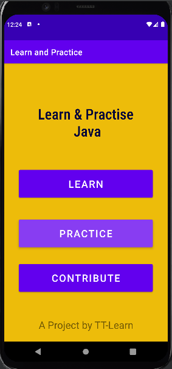
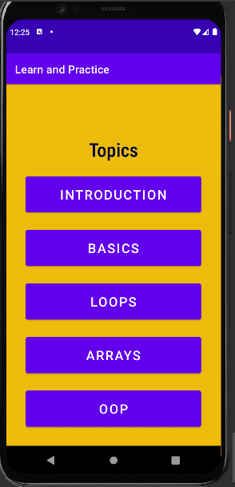
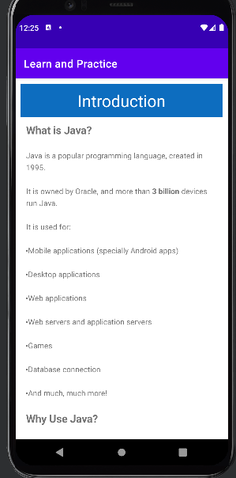
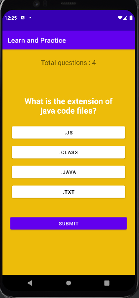
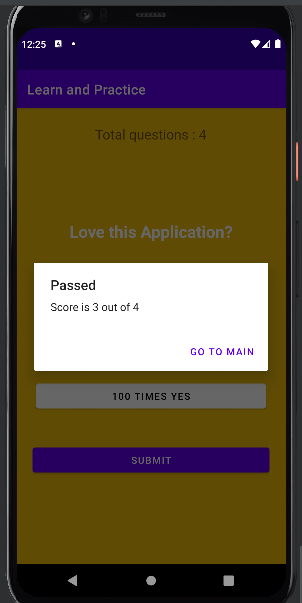
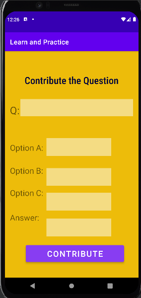

# Learn & Practice App
This facilitates the beginers Programmer to cover the java topics with Practice. This app covers concepts of Layouts, Intent & Activites Activites and Click Listeners, taught by us in course of **Mobile Computing**.    

## Features
- Learn any Topic
- Give Quiz & get Evaluated
- Contribute for Quiz

## Screenshots
Main Panel    |  Learn Panel  |  Topic Panel
:-------------------------:|:-------------------------:|:-------------------------:
  |   |  

Quiz Panel |  Result Panel     | Contribute Panel
:-------------------------:|:-------------------------:|:-------------------------:
  |   |  

## Installation 🔌
1. Press the **Fork** button (top right the page) to save copies of these projects on your account.

2. Download the repository files (projects) from the download section or clone this project in your PC by using clone command or downloading zip file.

3. Imported any project in Android Studio. or any other, like Intellij IDEA

4. Run the application :D

## Contributing 💡
If you want to contribute to this project and make it better with new ideas, your pull request is very welcomed.
If you find any issue just put it in the repository issue section, Thank you.

.سبحَانَكَ اللَّهُمَّ وَبِحَمْدِكَ، أَشْهَدُ أَنْ لا إِلهَ إِلأَ انْتَ أَسْتَغْفِرُكَ وَأَتْوبُ إِلَيْكَ
